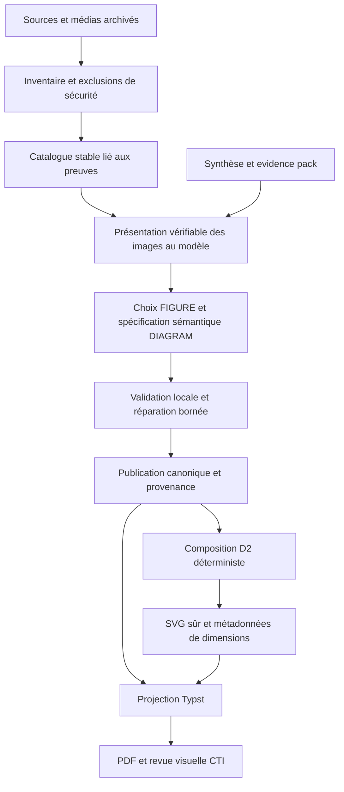

# Plan de reprise — sélection des images et rendu CTI professionnel

Date : 5 octobre 2026. Livrable : plan d'exécution, sans modification du produit.

## 1. Objectif et règles de reprise

Rendre le modèle capable de sélectionner des images réellement consultées et identifiées, et de proposer des diagrammes dont la structure analytique permet un rendu D2 lisible dans le bulletin CTI. Terminer les corrections interrompues, puis simplifier les chemins concernés sans supprimer les protections de preuve, de sécurité ou de reprise.

Ce document est destiné à être exécuté lot par lot par un modèle moins performant. Respecter l'ordre, les fichiers autorisés et les critères de sortie. Ne pas commencer par une réécriture générale. Chaque lot fournit un changement testable ; ne pas déclarer le chantier terminé au seul motif que les tests unitaires passent.

Contraintes :

- PostgreSQL, fichiers versionnés et evidence packs restent canoniques ; les exports de `var/workspaces` servent seulement de témoins du run.
- Corps de documents et médias dans MinIO ; métadonnées et SHA-256 dans PostgreSQL. Aucune image binaire ni base64 persistée dans les métadonnées JSON.
- Respecter `external_llm_allowed`, TLP et `do_not_submit` avant toute présentation au modèle.
- Ne pas modifier les corrections du transport bridge : attente, réconciliation, récupération, retries et identité des conversations sont hors périmètre. L'adaptation du contrat de présentation des images, si nécessaire, est un travail distinct.
- Aucun appel externe dans les tests. Une démonstration avec le bridge réel sera une recette séparée, bornée et tracée.
- Ne pas éditer directement les exports de `var`, ni les rapports A/B. Ne pas utiliser leur contenu comme un état canonique de production.
- Lire les instructions du composant avant de le modifier. Le frontend ne sera concerné que si un contrat affiché change ; lire alors son `AGENTS.md`.
- Ne pas créer de migration de compatibilité historique ni restaurer aveuglément les diffs A/B. Suivre la règle du baseline mutable si une évolution persistée devient nécessaire.

## 2. Sources et limites de l'audit

Documents effectivement examinés :

- [Rapport A](/home/nill/.cache/audit/out/A/final.md) et extraits ciblés de [son journal](/home/nill/.cache/audit/out/A/codex.log).
- [Rapport B](/home/nill/.cache/audit/out/B/final.md) et fin de [son journal](/home/nill/.cache/audit/out/B/codex.log).
- Aperçus [diagramme/figure A](/home/nill/.cache/audit/out/A/diagram-bitcoin-flow.png) et [références/IOC B](/home/nill/.cache/audit/out/B/frontmatter-ioc-review-1.png).
- [Diagnostics du run](/home/nill/perso/work/AutoWork/var/diagnostics/events.jsonl), notamment le run `d27fa0ff-e5d6-4ffe-bee2-4d033831bccb`, arrivé à l'assemblage le 5 octobre à 14:22 UTC.
- Code et tests actuels des contrats, de l'enrichissement, de D2 et des helpers Typst.
- La pièce jointe du modèle interrompu est uniquement une liste de fichiers modifiés, sans raisonnement, compte rendu ni résultats de tests.

Les images A/B sont des fixtures de revue, pas le PDF final du run réel. Le grand rectangle bleu de A est une image synthétique de test ; il ne démontre pas une sélection de média réel. Le rapport B dit que le rendu réel était ignoré alors que des artefacts PDF/PNG existent : leur provenance doit être vérifiée avant de les présenter comme validation. Aucun PDF final du run réel n'a été trouvé dans les fichiers de workspace examinés.

### État constaté et interprétation

| Sujet | Preuve actuelle | Traitement |
| --- | --- | --- |
| Images non sélectionnées | Dernier enrichissement : 0 figure ; export : `figures=[]` | Absence constatée ; cause précise à reproduire, aucun quota d'image imposé |
| Présentation visuelle au modèle | `ModelRequest` et `SafeModelRequest` n'ont pas de pièces jointes ; catalogue textuel et `web_search=True` | Déficit de contrat confirmé ; ouvrir une page ne garantit pas la consultation du média archivé |
| Écart avec A | A annonce `ModelImagePart`, 8 images et data URI ; ces éléments sont absents aujourd'hui | Vérifier la décision qui les a supprimés ; ne pas restaurer aveuglément |
| Catégories de diagrammes | Export : flux Bitcoin nommé `infection_chain` ; premier rejet de run : séquence d'infection non documentée | Conserver la validation CTI et améliorer la proposition sémantique |
| Styles D2 | Palette colorée par rôle déjà présente | Ne pas recréer une palette ; finir disposition, relations, lisibilité et légende |
| Politique de disposition | Domaine : seuil >3 nœuds ; compilateur et prompt : >4 ; helper du domaine sans appel | Correction interrompue et duplication confirmées |
| Régression de checks | `Iterable` non importé ; 2 attentes de styles D2 obsolètes | Premier lot de stabilisation |
| Taille du diagramme | Aperçu A : petite bande de nœuds, grand espace vertical ; Typst fixe une hauteur de 12 cm | Défaut visuel de fixture confirmé, prévoir dimensionnement naturel |
| IOC | Aperçu B : lignes très serrées ; helper `set par(leading: 0pt)` | Défaut visuel à corriger et vérifier avec listes longues |
| Annotation | Export : `Chainalysis`, `SafeBreach`, `Satoshi` annotés `actor` | Corriger le guidage sémantique ; ne pas confondre éditeur, référence historique et acteur de menace |
| Projection des preuves | Run : `KeyError` sur une preuve de réserve ; `_catalogue_handles` filtre maintenant les références absentes | Correction présente, protéger par régression ; vérifier que le filtrage ne supprime pas des justifications utiles |
| Synthèse | Deux rejets `synthesis_output_invalid` avec diagnostic insuffisant dans le run ; code ajoute aujourd'hui `validation_reason` | Régression/observabilité, pas preuve que le problème persiste |
| Références/IOC séparés | B annonce publication v6 ; code actuel utilise publication v5 avec ces champs ; synthèse v2 présente | Le code actuel décide du contrat, pas le numéro annoncé dans un rapport |
| Source Trellix | `unsafe_destination`, source de soutien indisponible | Limite de collecte à expliquer ; ne pas contourner SSRF ni inventer une source |
| QA publication | Assemblage `qa.passed=true` malgré un résultat visuel pauvre | La QA actuelle n'est pas une validation de mise en page |

## 3. Baseline de validation réellement exécutée

Environnement : commandes Make, cache UV redirigé vers `/tmp/autowork-uv-cache`, résolution offline. Le locator a fonctionné via `python scripts/ctx/ctx.py` en fallback lexical ; son invocation initiale via UV depuis la racine était bloquée par cache puis réseau.

1. `make test-backend PYTEST_ARGS="tests/test_d2_diagram_compiler.py tests/test_production_editorial_enrichment_application.py tests/test_publication_builder_v4.py tests/test_production_reuse.py -q --tb=short"` : **222 passed, 2 failed**.
   - `test_escapes_hostile_labels_as_double_quoted_content` attend encore `shape: oval`.
   - `test_node_role_selects_deterministic_print_safe_shape_and_colour` attend encore l'ancienne couleur `#E8F0F0`.
2. `make test-backend PYTEST_ARGS="tests/test_typst_chp_parity.py tests/test_typst_compiler_runtime.py tests/test_d2_diagram_compiler_runtime.py tests/test_production_synthesis_application.py tests/test_semantic_annotation_l13.py tests/test_publication_qa_v4.py -q --tb=short"` : **148 passed, 8 skipped**.
   - Typst attendu : 0.15.1, réponse de version locale vide.
   - D2 attendu : 0.9.0, version locale : 0.7.1.
3. `make lint-backend` : échec Ruff F821 sur `Iterable` dans le domaine d'enrichissement. Le format check suivant n'a donc pas été atteint.
4. `make typecheck-backend` : **1 erreur dans 480 fichiers**, même import manquant.

Ni suite complète backend, ni frontend, ni intégration PostgreSQL, ni appel réel bridge réalisés dans cette analyse. Les résultats des rapports A/B ne remplacent pas cette baseline.

## 4. Architecture cible

Le modèle décide de la question analytique, du contenu, des rôles, des relations, des regroupements et du placement. Le renderer décide du style graphique cohérent, des formes, des couleurs et des dimensions. Améliorer les capacités de composition ne signifie pas demander du D2 libre au modèle : conserver la spécification structurée et les identifiants synthétiques évite les imports, liens, faits et codes non contrôlés.

## 5. Lots d'exécution

### Lot 0 — Terminer la stabilisation interrompue

**Dépendance :** aucune. **Périmètre :** domaine d'enrichissement, compilateur D2, prompt d'enrichissement et tests D2.

1. Importer `Iterable` depuis `collections.abc` dans le domaine concerné.
2. Conserver `diagram_requires_vertical_layout` comme règle unique : disposition verticale si plus de 3 nœuds ou un libellé de plus de 30 caractères. Cette valeur >3 correspond à l'intention du helper actuel et évite le cas de 4 boîtes trop étroit observé dans A.
3. Appeler cette règle depuis `encode_d2_source`. Alimenter les indications du prompt depuis les constantes du domaine au lieu de recopier des chiffres. Mettre aussi à jour les exemples/texte du contrat ; éliminer le seuil >4 contradictoire.
4. Choisir explicitement la palette actuelle comme base, puis ajuster les deux tests de styles. Le test d'échappement doit surtout vérifier l'échappement et l'absence d'injection ; retirer son attente de forme sans rapport avec ce comportement et conserver un test dédié au rôle `unknown`.
5. Ne pas réduire les assertions de sécurité pour obtenir du vert. Préserver les labels hostiles, `${...}`, groupes et URLs littérales.

**Tests :** D2 unitaire, enrichissement, lint et mypy. **Sortie :** seuil identique pour 3/4 nœuds et labels de 30/31 caractères ; aucun helper inutilisé ; checks du lot verts.

### Lot 1 — Reconstituer le chemin réel des images avant de changer le contrat

**Dépendance :** lot 0. **Périmètre :** inventaire/collecte média, evidence pack d'enrichissement, diagnostics et fixtures.

Fichiers d'entrée : [source_figure_inventory.py](/home/nill/perso/work/AutoWork/backend/src/cti_app/application/source_figure_inventory.py), [production_editorial_enrichment.py](/home/nill/perso/work/AutoWork/backend/src/cti_app/application/production_editorial_enrichment.py), modules voisins `source_media_collection` et `source_media_extraction`.

1. Reproduire offline le catalogue à partir d'une fixture représentative des articles Chainalysis et SafeBreach. Ne pas réutiliser `publication.json` comme extraction canonique ; retrouver les artifacts et médias vérifiés ou créer une fixture minimale explicitement synthétique.
2. Produire des compteurs et motifs : observations → archivés → acceptés → éligibles dans le pack → présentés au modèle → sélectionnés → inclus → rendus.
3. Pour chaque entrée, tracer localement handle, source, SHA-256, statut et motif. Le prompt expose des handles de source `S001` plutôt que les UUID internes et la liste des evidence handles éligibles **de cette source**.
4. Ajouter ces evidence handles au catalogue : actuellement la contrainte « preuve de la même source » est vérifiée localement, mais la projection du catalogue ne donne pas directement cette association.
5. Identifier les entrées acceptées sans preuve éligible de leur source. Les marquer non sélectionnables avec motif ; ne pas laisser le modèle produire un choix condamné au rejet.
6. Examiner la déduplication globale par SHA : une image identique dans deux sources peut perdre une occurrence et sa provenance. Séparer identité du blob et occurrence source si le cas est reproduit ; ne pas changer tous les UUID sans preuve du besoin.
7. Vérifier que les exclusions techniques ne deviennent pas des décisions éditoriales : limite de pixels/bytes protège le système ; un ratio extrême peut aussi être un graphe CTI utile. Tracer les exclusions et prévoir une revue/normalisation sûre des cas utiles, sans desserrer les plafonds mémoire.
8. Harmoniser les noms montrés dans les instructions avec les champs réels (`nearby_heading`, `alt`, `caption`, etc.). Le contrat actuel mentionne aussi `nearby_heading_text` et `alt_text`, absents de cette projection.

**Tests :** accepted/rejected/pending ; preuve absente de la source ; média dans un encart related-content ; deux occurrences du même blob ; catalogue tronqué ; PDF non extrait. **Sortie :** cause de « 0 image » classée sans spéculation et catalogue directement exploitable par un modèle faible.

### Lot 2 — Garantir ce que le modèle peut réellement voir via le bridge

**Dépendance :** lot 1. **Périmètre :** contrat gateway/sanitizer, adaptateur d'entrée, préparation des aperçus, diagnostics de sélection. Aucun changement du transport/réconciliation.

Entrées : [model_gateway.py](/home/nill/perso/work/AutoWork/backend/src/cti_app/application/model_gateway.py), [models.py](/home/nill/perso/work/AutoWork/backend/src/cti_app/integrations/models.py), fonction `build_editorial_enrichment_model_request`.

**Étape préalable obligatoire :** vérifier les capacités documentées du bridge actuellement utilisé, et l'historique disponible de la suppression de `ModelImagePart`. Le code local ne prouve pas que le bridge accepte les `input_image` ou des uploads. `web_search` ne constitue pas une capacité vision. Ne pas inventer un champ de protocole ou déduire sa prise en charge d'un test mocké.

Décision d'exécution bornée :

- Si une entrée image est réellement supportée : préparer des aperçus des blobs archivés, puis envoyer des parties image typées liées aux handles.
- Si seul l'accès visuel à des URLs publiques est réellement supporté : autoriser une revue de l'image originale à partir de son URL exacte, mais distinguer « image en ligne consultée » de « octets archivés consultés ». La sélection finale reste liée au blob archivé ; tout écart ou absence de vérification doit être explicite. Ne pas publier MinIO ni ses credentials pour contourner cette limite.
- Si aucune présentation visuelle n'est supportée : renvoyer un état de capacité insuffisante pour la sélection visuelle et un résultat honnête. Un choix fondé sur le contexte textuel peut être proposé pour revue, sans prétendre avoir vu l'image. Documenter l'évolution minimale de capacité bridge nécessaire comme dépendance externe.

Pour la voie image supportée :

1. Définir un objet d'entrée typé distinct des `metadata` et `parameters`, avec handle, MIME, SHA original et référence de l'aperçu. Les bytes éventuels ne transitent qu'à travers le port autorisé et ne sont pas loggés.
2. Préparer des aperçus déterministes : orientation appliquée, conservation du ratio, long côté ≤1024 px, ≤400 KiB/image, ≤8 images/appel, sélection finale ≤3 figures. Ce sont des budgets initiaux reprenant A, à vérifier avec le vrai contrat ; ne pas les confondre avec une garantie de transport.
3. Archiver si nécessaire les aperçus dérivés avec leur propre SHA et version de transformation ; garder le lien avec le SHA original. Publier les originaux admissibles, pas automatiquement les vignettes.
4. Associer chaque partie visuelle à son handle dans une courte portion textuelle adjacente, sans se fier uniquement à l'ordre des uploads. Ne jamais choisir une image par position DOM.
5. Le sanitizer doit contrôler autorisation, MIME et taille et inclure le manifeste média dans le hash autorisé. Une modification de l'image, de son mapping ou de sa transformation doit changer l'identité d'entrée.
6. Un adaptateur incompatible doit déclarer/rejeter la capacité demandée ; il ne doit pas ignorer silencieusement les parties image, comportement annoncé dans A.
7. Pour >8 candidats, créer une présélection contextuelle déterministe avec trace des exclus, puis des lots bornés si nécessaire. Ne pas montrer 128 handles en laissant entendre que tous ont été vus. Fixer avant implémentation une borne de 3 lots maximum et tracer les candidats non revus.
8. La réparation reçoit le même manifeste et les mêmes médias utiles ; un nouvel appel textuel ne doit pas prétendre conserver une vision acquise dans une conversation stateless précédente.
9. Supprimer la contradiction « pas de recherche »/« ouvre la page » pour la voie d'images archivées. La recherche de ressources reste un appel distinct et ses réponses ne deviennent jamais directement de la preuve canonique.

**Tests :** interdit par TLP/permission avant soumission ; MIME/taille rejetés ; mapping F001/F002 sans ambiguïté ; >8 candidats ; image différente ⇒ hash différent ; adaptateur sans vision explicite ; réparation avec le bon manifeste ; aucun base64 dans diagnostics. Ajouter un test de contrat du payload réel supporté, pas d'un payload fictif.

**Recette réelle :** article avec une image CTI utile et une décoration ; le modèle identifie ce qu'il voit, choisit la bonne entrée, rédige une légende fondée, et les octets publiés correspondent au SHA attendu. La réponse « aucune image utile » reste valide. La réussite exige une preuve de présentation/capacité, pas seulement un bloc FIGURE bien formé.

### Lot 3 — Fiabiliser les décisions et la provenance des figures

**Dépendance :** lot 2. **Périmètre :** parser FIGURE, proposition validée, figure decisions, builder/assembly et tests.

1. Conserver les blocages pour handle inconnu, pending/rejected, preuve étrangère et placement inexistant.
2. Distinguer : non éligible, non présentée, présentée non retenue, retenue, sélection rejetée. Actuellement une absence de bloc devient `NOT_SELECTED_BY_MODEL`, ce qui ne démontre pas une revue visuelle. Introduire les contrôles comme enums typés.
3. Ne demander une raison explicite que pour les figures présélectionnées et effectivement revues ; tracer séparément les autres sans fabriquer une raison du modèle.
4. Une légende décrit le média et son intérêt pour la section, sans extrapoler les chiffres ni l'identité d'un acteur. Ne pas inventer de traduction d'un détail illisible. Une légende vide doit être rejetée ou remplacée explicitement par une caption source validée ; aligner parser et branche fallback.
5. Préserver toute la chaîne source → occurrence → blob/hash → handle → décision → figure incluse → numéro de publication. Numérotation commune figures/diagrammes selon l'ordre de rendu.
6. Réparation bornée d'un bloc FIGURE invalide, conservation des frères valides et exclusion explicite des irréparables. Aucun téléchargement d'URL proposée à l'assemblage.

**Sortie :** fixture image choisie de bout en bout jusqu'au PDF, provenance correcte, absence d'images justifiée. Tests d'identité, numérotation mixte et conservation des blocs valides.

### Lot 4 — Faire proposer une composition CTI au modèle

**Dépendance :** lots 0 et 1 ; peut être exécuté avant la recette externe du lot 2. **Périmètre :** contrat DIAGRAM, projection des preuves, validation et exemples du prompt.

1. Conserver l'interdiction de code D2/SVG libre. Étendre l'exemple sémantique, pas le langage de rendu externe.
2. Fournir trois exemples courts complets : flux réseau, composants regroupés en zones, comparaison de mécanismes. Inclure les champs analytiques déjà obligatoires, rôles, groupes et relations ; ne pas ajouter un second format parallèle.
3. Écrire des labels courts sans tronquer les littéraux techniques. Déplacer une explication longue dans la caption ; si un littéral exact dépasse le budget, permettre une abréviation descriptive accompagnée de la valeur exacte dans le texte/table voisin, jamais une valeur falsifiée.
4. Décrire les groupes comme zones analytiques documentées : poste compromis, chaîne publique, infrastructure hors chaîne. Un groupe ne crée pas à lui seul un lien causal ; ne pas ajouter une machine/serveur non documenté pour embellir.
5. Vérifier les budgets (8 nœuds, 6 mots/≈40 caractères par label, 5 mots par relation) et renvoyer des erreurs précises réparables. Les chiffres approximatifs du prompt ne doivent pas devenir une troncature aveugle dans le compiler.
6. Faire distinguer relation factuelle, inférence, comparaison et sens de transfert. Une comparaison ne doit pas ressembler à un trafic bidirectionnel. La notion de requête/réponse doit être exprimée par deux relations documentées si elle est nécessaire.
7. Exemple du run Bitcoin : demander « Comment les données C2 sont-elles publiées puis récupérées ? », `KIND: network_flow`, et des nœuds tels que « Opérateur présumé », « Transaction Bitcoin OP_RETURN », « Malware », « Activité hors chaîne », **seulement si chacun et chaque lien sont justifiés par les preuves**. Ne pas ajouter une arête MOIS → opérateur certaine ; garder la réserve d'attribution dans le texte/caption.
8. Pour un diagramme irréparable, permettre l'omission explicite sans forcer de graphique. Une relation contre-indiquée reste bloquée ; ne pas affaiblir ce contrôle pour diminuer le taux de rejet.

**Tests :** cas Bitcoin correctement typé ; infection_chain non documentée rejetée ; comparaison non causale ; groupe sans membres/chevauchement invalide ; arête vers nœud absent ; labels longs réparés ; aucune assimilation SafeBreach/Prince of Persia à l'opérateur du sujet.

**Sortie :** un modèle faible peut produire une spécification complète sans deviner la syntaxe de GROUP ni les rôles. Ne pas imposer de minimum de nœuds ni de diagramme.

### Lot 5 — Composer et styliser D2 à l'échelle du bulletin

**Dépendance :** lot 4. **Périmètre :** domaine de composition si besoin, [d2_diagram_compiler.py](/home/nill/perso/work/AutoWork/backend/src/cti_app/infrastructure/d2_diagram_compiler.py), port de compilation, tests runtime.

1. Partir de la palette actuelle : acteur rose, victime ambre, malware orange, infrastructure bleue, donnée verte, technique violette, inconnu gris ; contours sombres, texte sombre. Éviter de surcharger un petit graphe avec toutes les couleurs.
2. Garder les formes comme second indice accessible ; victime rectangle, jamais diamond ambigu avec une décision logique. Ajouter une légende compacte uniquement pour les rôles/relations présents quand leur sens n'est pas évident.
3. Styles relationnels : factuel plein avec flèche si direction justifiée ; inférence pointillée et explicitement identifiée ; comparaison sans flèches causales, avec libellé clair. Ne pas conserver `<->` comme unique représentation implicite de comparaison.
4. Séparer la décision de composition (règle métier) de l'encodage technique D2 : direction effective, groupes, profil de densité. Le domaine/application décide ; l'infrastructure sérialise et exécute. Ne pas construire un nouveau framework générique pour ce seul besoin.
5. Garder D2 0.9.0 comme base. Ne changer de layout engine qu'après un échec visuel reproduit et une décision justifiée ; ne pas supposer que l'engine supporte des contraintes sans runtime test.
   **Décision du 2026-10-07 :** le diagramme Arman publié reproduit sous `dagre` avec 1 chevauchement texte/texte. Sur les quatre diagrammes publiés, `dagre` par défaut et `dagre` avec `nodesep=120`/`edgesep=40` donnent chacun `[1, 0]` sur Arman et `[0, 0]` sur les trois autres (chevauchements texte/texte, puis libellés d'arête/formes de nœud). ELK par défaut donne `[0, 0]` sur les quatre, mais l'estimation d'impression A4 conservative donne seulement 7,52 pt pour les nœuds et 6,01 pt pour les arêtes d'Arman. ELK avec `--pad=8 --elk-nodeNodeBetweenLayers=15` donne `[0, 0]` partout et un minimum estimé de 10,42 pt/nœud et 8,34 pt/arête ; le compilateur épinglé adopte cette configuration.
6. Tester les styles de flèches, groupes et formes avec le vrai binaire épinglé : la validité d'une chaîne D2 mockée ne prouve pas la validité de cette combinaison.
7. Dimensionner à partir du résultat SVG (`viewBox`/dimensions validées), de la largeur imprimée et des tailles de police effectives. Le font-size 30 dans le SVG ne garantit pas un texte lisible une fois réduit dans le PDF.
8. Cible initiale : labels de nœud ≥9 pt et d'arête ≥8 pt à la taille imprimée. Si non atteinte : disposition verticale/compaction déterministe, puis rejet de mise en page avec diagnostic. Ne pas inventer de faits ni supprimer une relation pour rentrer dans la page.
9. Préserver identifiants synthétiques, échappement D2, déterminisme source/SVG, limites du subprocess et validateur anti-ressources externes. Une icône intégrée n'est autorisée que si versionnée et locale ; aucun téléchargement d'icône par D2.

**Fixtures obligatoires :** 2 étapes ; 4 étapes Bitcoin ; 8 nœuds et groupes ; branches ; cycle documenté ; comparaison ; labels accentués ; littéral long ; inférence ; groupe transversal.

**Sortie :** fichiers D2/SVG générés, compilation réelle verte, images de revue à l'échelle A4. Personne ne doit avoir besoin de zoomer pour lire les relations.

### Lot 6 — Corriger la mise en page Typst et les IOC

**Dépendance :** lots 3 et 5 pour la validation complète. **Périmètre :** [publication_helpers.typ](/home/nill/perso/work/AutoWork/chpTypst/RENDERER/publication_helpers.typ), [helpers.typ](/home/nill/perso/work/AutoWork/chpTypst/UTILS/helpers.typ), projection `typst_rendering`, chemins article/édition et tests de parité.

1. Remplacer les boîtes fixes `height: 12cm` et `height: 9cm` par un dimensionnement proportionnel à la taille naturelle, largeur disponible et hauteur maximale. Ne pas réserver 12 cm à une bande horizontale de 2 cm.
2. Garder image et caption ensemble lorsque le bloc tient sur une page ; si le média est trop haut, le réduire selon une borne lisible ou proposer un format de page explicite. Ne pas rendre toute la synthèse non sécable.
3. Afficher une seule légende sous le diagramme, titre en fallback, numérotation globale stable. Provenance et repère sur des lignes discrètes séparées pour les figures sources.
4. Retirer `leading: 0pt` des IOC ; choisir une taille mono de 8.5–9 pt et interligne mesuré sans chevauchement. Mettre le titre « IOC originaux » et sa réserve sur des blocs séparés.
5. URLs/domaines/hashes longs : autoriser une rupture visuelle sûre sans modifier la valeur canonique ni ajouter des espaces copiables dans un IOC. Tester extraction texte et, si pertinente, copie depuis le PDF. Pagination sans liste tronquée, en-tête/explication clairement associés à chaque groupe.
6. Vérifier que les IOC liés au sujet et les IOC originaux à lien non démontré restent séparés. Ne pas déplacer des IOC depuis le groupe réserve vers le groupe opérationnel pour remplir une section vide.
7. Références : dates des publications distinctes des dates d'événements ; date inconnue explicitement indiquée, aucune substitution par la date de collecte. Ordre déterministe, liens dédupliqués et renvois stables.
8. Recompiler les helpers réels, sans shim de `UTILS/helpers.typ`. L'ancienne erreur de syntaxe rapportée par A est un antécédent, pas une erreur actuelle démontrée ; seule cette compilation décidera.
9. Faire passer les cas article et édition par la même projection/helper. Mettre à jour le hash/version du bundle pour empêcher le réemploi d'un rendu ancien.

**Sortie :** vrais PDF article et édition, comprenant un diagramme, une figure pertinente, une liste de 100 IOC et une URL/hash long. Revue de toutes les pages rendues en PNG ; pas de grande zone vide artificielle, texte coupé, caption orpheline ni lignes superposées.

### Lot 7 — Corriger les autres défauts du run sans rouvrir le bridge

**Dépendance :** lot 0. **Périmètre :** synthèse, projection de pertinence, annotation, QA et diagnostics des étapes.

1. **Projection des preuves :** ajouter le cas exact du `KeyError` ancien : une synthèse cite une preuve de réserve non présente dans le catalogue E. Vérifier que le pack reste construit et que le contexte `LINK_NOT_DEMONSTRATED` demeure visible comme réserve non citable, sans attribuer un handle autoritatif à une preuve hors périmètre.
2. **Synthèse :** protéger `validation_reason` déjà ajouté. Un rejet doit indiquer la règle et le bloc/handle concernés, sans recopier un texte sensible complet. Distinguer couverture manquante parce que le modèle a omis une preuve et information absente des sources. Aucun minimum arbitraire de victimologie/persistance ne doit pousser le modèle à inventer.
3. **Annotations :** enrichir les exemples positifs/négatifs pour éditeur vs acteur de menace, Satoshi historique vs acteur d'attaque, outil/technique vs malware. Garder la proposition contextuelle ; ne pas mettre une liste noire `Chainalysis`/`SafeBreach` codée en dur. Le rôle `source` peut servir aux éditeurs dans la prose selon la convention existante ; décider cette convention une fois et la tester.
4. **Réserves d'attribution :** conserver les termes présumé/soupçonné et les liens non démontrés dans la synthèse, la timeline et les légendes. La timeline de l'export affirme un lien MOIS plus directement que le lead : vérifier si la preuve l'autorise et conserver son degré de certitude dans la projection.
5. **Collecte Trellix :** conserver le blocage `unsafe_destination`. Distinguer indisponibilité, refus de sécurité et erreur transitoire dans les diagnostics. Ne poursuivre une correction du resolver/collecteur que si une fixture prouve un faux positif ; ne pas désactiver la protection sur la base de ce run.
6. **Extraction Q2 :** isoler les warnings `q2_unexpected_structure` et `source_evidence_not_text_verifiable` sur une fixture de réponse archivée vérifiée si disponible. Corriger une variante documentée de grammaire, sans inventer un parseur permissif qui accepterait des preuves non vérifiables.
7. **QA :** conserver les checks exacts canoniques ; ajouter les signaux de présentation/capacité média et de lisibilité disponibles. Séparer le résultat QA contenu et la revue visuelle du PDF. `qa.passed=true` ne doit pas être présenté comme « rendu professionnel validé » sans recette visuelle.

**Sortie :** chaque défaut ancien a une régression ou un statut « non reproduit / déjà corrigé / données manquantes », avec raison. Ne pas annoncer que tous les warnings ont disparu sans rejouer leur entrée.

### Lot 8 — Simplifier après stabilisation des comportements

**Dépendance :** lots fonctionnels verts. **Périmètre :** fonctions réellement touchées, tests associés, contrats de version ; aucune refonte transversale opportuniste.

1. Supprimer les seuils dupliqués et les branches fallback inatteignables prouvées. Vérifier tous les appelants, y compris `production_enrichment_revision`, avant de supprimer un champ/fonction.
2. Le module d'enrichissement dépasse 5 900 lignes. Extraire seulement des responsabilités cohérentes si cela réduit les dépendances : contrat wire/parser, catalogue/préparation média, annotation, orchestration. Conserver les ports publics utiles ; éviter des reexports de compatibilité sans consommateur.
3. Préférer enums de contrôle, dataclasses/objets immuables et `collections.abc` ; remplacer les `Any` seulement lorsque le contrat concret est établi. Utiliser `replace` pour modifier un objet immuable au lieu de reconstruire toutes ses propriétés.
4. Garder des `except` étroits dans les fonctions ordinaires. Un `except BaseException` qui libère les waiters d'une future lors d'annulation, comme dans le cache de version D2, peut être nécessaire : ne pas le supprimer comme « non pythonique » sans tester annulation et concurrence.
5. Simplifier les versions/identités en maintenant la distinction invocation modèle / parsing / compilation / bundle rendu. Une modification du parser permet le reparse d'une réponse archivée ; une modification du manifeste visuel exige une nouvelle invocation ; un changement de style D2 ne doit pas relancer une synthèse inchangée.
6. Ne pas supprimer les readers de schémas réellement utilisés par des artifacts/reprises sous prétexte qu'ils sont anciens. Inventorier leurs consommateurs ; supprimer seulement les chemins démontrés morts. Ne pas créer en parallèle un mécanisme de migration historique interdit.
7. Réconcilier les numéros annoncés par A/B avec les constantes actuelles. Nommer une nouvelle version selon le contrat final et mettre à jour sérialisation, hashes, tests de reuse et clients affectés ensemble.
8. Pas de test qui ne fait que recopier une table de constantes. Tester les conséquences : mauvaise association média, changement de hash, mauvaise projection, parsing ou rendu invalide.

**Sortie :** comportement identique sur les fixtures acceptées, moins de duplication, aucun appelant cassé et aucune politique de sécurité dégradée.

## 6. Protocole de validation et de livraison

### Checks par lot

Utiliser `make test-backend PYTEST_ARGS="... -q --tb=short"` avec les fichiers concernés :

- Images : `tests/test_source_figure_inventory.py`, `tests/test_model_gateway.py`, `tests/test_production_editorial_enrichment_application.py` et tests de l'adaptateur identifiés par le locator.
- Diagrammes : `tests/test_d2_diagram_compiler.py`, `tests/test_d2_diagram_compiler_runtime.py`, enrichissement, publication builder/assembly.
- Rendu : `tests/test_typst_rendering.py`, `tests/test_typst_chp_parity.py`, `tests/test_typst_compiler_runtime.py`, `tests/test_edition_typst_rendering.py`.
- Logique du run : synthèse application, pertinence modèle/domaine, `tests/test_semantic_annotation_l13.py`, `tests/test_publication_qa_v4.py`, `tests/test_production_reuse.py`.

À la fin : `make lint-backend`, `make typecheck-backend`. Intégration nécessaire si persistance/provenance/hash change : `make test-integration INTEGRATION_TEST_PATH=tests/integration/test_source_figure_inventory.py INTEGRATION_PYTEST_ARGS="-q --tb=short"`, puis les fichiers d'intégration publication/reuse affectés. Frontend : checks seulement si modifié, après lecture de ses instructions.

La recette de rendu exige D2 **0.9.0**, Typst **0.15.1** et le font bundle verrouillé. Utiliser les scripts d'installation existants ou les binaires CI connus. Ne pas télécharger de compilateur depuis une fixture de test ; ne pas remplacer le test réel par un shim ou par D2 0.7.1. Un test runtime ignoré laisse le critère de rendu non validé.

### Matrice de recette minimale

| Scénario | Résultat requis |
| --- | --- |
| Une image CTI utile et une décoration | Média utile consulté puis choisi ; décoration exclue ; même SHA jusqu'au rendu |
| Aucune capacité visuelle | Limite explicite ; aucun faux statut « revue visuelle effectuée » |
| Plus de 8 candidats | Budget respecté ; candidats présentés identifiés ; non revus tracés |
| TLP interdit ou `do_not_submit` | Aucune image ni donnée soumise à l'externe |
| Flux Bitcoin | Type réseau, attribution réservée, relations courtes et lisibles |
| Diagramme comparatif | Aucun effet visuel de causalité/communication bidirectionnelle inventée |
| 8 nœuds, branches et zones | Pas de chevauchement ; labels à la taille imprimée minimale |
| Figure et diagramme entre deux sections | Placement et numérotation communs corrects ; caption attachée |
| 100 IOC, URL et SHA-256 longs | Pagination complète, aucune superposition/troncature, valeurs exactes |
| Reprise après changement de parser | Reparse des bytes vérifiés, sans appel modèle inutile |
| Reprise après changement d'image/prompt | Nouvelle identité d'invocation ; aucune réutilisation invalide |
| Article et édition | Même contenu/catégories/provenance ; PDF compilés avec le vrai bundle |

### Définition de terminé

- Tous les lots nécessaires ont un compte rendu court : fichiers changés, checks, résultat, limite restante.
- Baseline lint/typecheck et tests concernés verte ; tests runtime requis effectivement exécutés.
- Une preuve de présentation d'image avec le bridge réel supporté existe, ou le manque de capacité est explicitement déclaré comme blocage externe. Un mock seul n'est pas suffisant.
- SVG/D2 et vrais PDF article/édition accompagnés de PNG de toutes les pages, revus à l'échelle du bulletin.
- Le résultat final ne contient ni diagnostics internes, ni attribution renforcée artificiellement, ni mélange d'IOC réserve et opérationnels.
- Versions, hashes et reprises testés ; aucune restauration globale des anciens diffs ni modification du transport bridge corrigé.

## 7. Handoff à donner au modèle exécutant

> Exécute uniquement le prochain lot non terminé de ce plan. Commence par lire ses fichiers d'entrée avec CodeGraph/locator et les instructions du composant. Compare les préconditions au code réel ; si elles ont changé, indique précisément l'écart au lieu de réécrire un lot déjà terminé. Fais un changement minimal qui atteint les critères de sortie, puis exécute les tests ciblés et rapporte les résultats exacts. Ne transforme jamais un skip de rendu, un mock d'entrée image ou un ancien rapport d'agent en preuve de fonctionnement réel. Ne touche ni aux corrections de transport bridge, ni aux exports `var`, ni à d'autres sessions. Documente le statut du lot et ses limites dans un compte rendu séparé ; passe au suivant seulement lorsque ses dépendances sont satisfaites.
