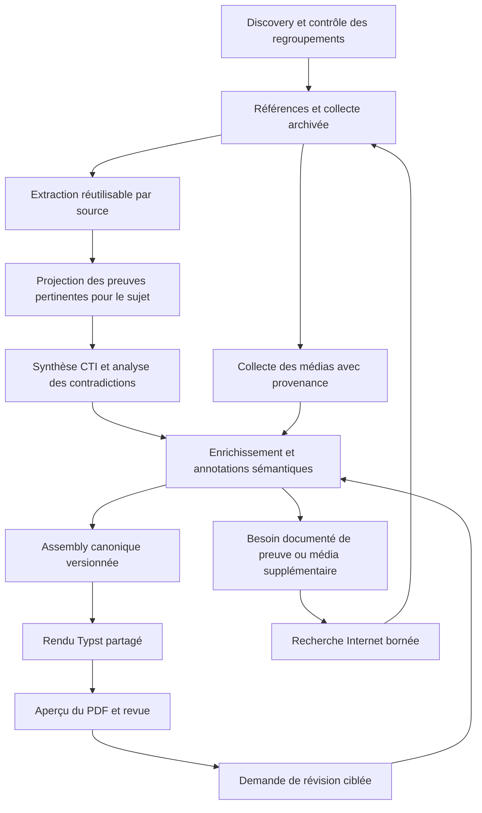

# Run réel CTI — audit et plan de correction de la qualité

Date : 2 octobre 2026. État examiné : HEAD `08c89f0`, avec les modifications non commitées présentes. Livrable : analyse et plan ; aucune correction applicative, aucun commit, aucune relance de production effectuée dans cet audit.

## 1. Conclusion et ordre de priorité

Les défauts observés dépassent la robustesse du parsing. La refonte a conservé la traçabilité des artifacts, mais a perdu plusieurs propriétés éditoriales du pipeline précédent : pertinence par sujet, exploitation narrative des sources complémentaires, consignes de rédaction CTI détaillées et typographie sémantique.

L'ordre recommandé est :

1. **Fiabiliser et valider les correctifs déjà présents**, puis supprimer l'obligation de JSON pour les sorties du bridge, notamment en synthèse et enrichissement.
2. **Rétablir le périmètre du sujet et la confrontation des sources**, avant d'améliorer la rédaction : une preuve réellement publiée peut être hors sujet ; un IOC malveillant pour une autre campagne n'est pas un IOC de ce sujet.
3. **Restaurer le contrat éditorial et la densité technique**, puis la typographie.
4. **Collecter et sélectionner les médias**, améliorer tableaux et diagrammes à partir des preuves disponibles.
5. **Afficher le véritable rendu Typst** et permettre des révisions ciblées, versionnées, des enrichissements.

L'accès Internet est utile pour rechercher une preuve ou une figure manquante. Il doit alimenter une collecte archivée, puis les étapes canoniques concernées. Activer uniquement `web_search=True` dans l'enrichissement ne résout ni la collecte des images, ni la contradiction entre sources, ni la pauvreté du corpus.

Les numéros L0 à L9 ci-dessous désignent les lots de ce document, sans créer de nouveaux tickets AW. Le [plan architectural historique](../references/plan.md) reste une référence de contexte ; plusieurs de ses constats décrivent désormais un état antérieur au code audité.

## 2. Preuves et limites de l'audit

### Matériaux examinés

- [Journal du run](../../var/diagnostics/events.jsonl) : 53 événements, avec traces d'échecs et résultats de stages. Les horaires cités ci-dessous sont en **UTC** ; ajouter deux heures pour Paris ce jour-là.
- [Publication matérialisée de la relance](../../var/workspaces/editions/2026-09_IR/items/001-Operateur-iranien-soupconne-lie-au-MOIS-utilisant-Bitcoin-OP_RETURN-comme-dead-d/article/publication.json) et [projection des artifacts](../../var/workspaces/editions/2026-09_IR/items/001-Operateur-iranien-soupconne-lie-au-MOIS-utilisant-Bitcoin-OP_RETURN-comme-dead-d/pipeline/production-state.json), exportée à 14:14:58 UTC depuis le run `c877e837-c5a8-496e-b317-a9d6975bca25`.
- Captures HTML archivées du sujet `d9d24833`, notamment Chainalysis et Bitquery, et manifestes des sources.
- Diffs non commités des composants concernés, code courant, templates Typst, comparaison ciblée avec `aw-001-complete` (`8700783`).
- [Ancienne édition Word](/home/nill/work/fiches/special_iran/juin-juillet/bulletin-8a9e41c5-0ab9-4f37-a3c6-3127d9b83545.docx) : structure OOXML et styles examinés ; conversion locale en PDF de 137 pages ; inspection visuelle des pages 1 à 3, dont le début de la synthèse Ababil / Black Shadow.
- [Plan des correctifs d'extraction déjà engagés](extraction-wire-format-recovery.md) et observations fournies avec la demande.

Les fichiers de `var/workspaces` portent explicitement `canonical: false` : ils constituent des projections d'observation, pas une autorité à réimporter automatiquement. L'audit n'a pas interrogé PostgreSQL ni MinIO. Les sorties brutes complètes de tous les appels modèle ne figurent pas dans les fichiers locaux examinés. Certaines observations du premier run restent donc rapportées par l'utilisateur, sans reconstitution indépendante de chaque réponse brute.

### Constats du premier run et de la relance

| Constat | Preuve examinée | Conséquence |
| --- | --- | --- |
| Premier intake : 12 candidates deviennent 12 sujets | `merge.applied`, 09:50:39, `deterministic_bootstrap`, aucun événement de fusion | Le bootstrap ne corrige pas un découpage trop fin proposé par Discovery. Les trois candidates précises mentionnées ne sont pas reconstituées dans le journal local. |
| Cinq références rejetées au premier passage | `reference_invalid_url`, 10:16:39, cinq blocs rejetés | La prise en charge des liens Markdown est un correctif utile déjà présent. |
| Qwen refuse l'authentification | 10:16:41, `provider_auth_failed` | Incident de configuration/routage, distinct de la qualité des prompts. |
| Bridge : timeout, ambiguïté DOM, fermeture d'onglet | Timeout de 900 s ; `ambiguous_response_roots` avec deux racines ; `bridge_extension_disconnected` | Plusieurs causes différentes ; pas un simple problème de JSON. Une synthèse a attendu environ 44 min 40 s avant l'erreur de déconnexion. |
| Réconciliation sans identité exploitable | Probe à 11:12:55 : `bridge_run_id: null`, résultat `undecided` | Examiner la transmission et la persistance de l'identité externe. |
| PDF CISA non collecté | 10:51:46 : `unavailable=1`, `source_collection_no_success` | Le journal ne fournit pas le statut HTTP permettant d'attribuer la cause. D'autres échecs concernent aussi le sujet HEAVYGRAM. |
| Premier passage complet malgré des omissions | 11:32 : 1 FULL, 2 IOC_RULES, 3 sources omises ; 28 faits, 11 événements | Un stage réussi ne garantit pas la complétude ni la pertinence du contenu. |
| Relance : extraction plus robuste | 14:08 : 1 FULL, 1 IOC_RULES, 40 faits, 11 événements, aucune omission ni warning | Signal favorable aux correctifs présents ; ce n'est pas une validation exhaustive de leurs cas limites. |
| Relance : enrichissement encore invalide | 14:10:50 : `editorial_enrichment_output_invalid` ; retry réussi à 14:14:58 | L'échec est confirmé. La cause syntaxique exacte exige la sortie brute et le détail de validation ; le journal local ne les donne pas. |
| Synthèse toujours principalement mono-source | Chainalysis : 40 faits et 11 événements ; Bitquery : 0 fait et 0 événement | Le récit ne peut pas exploiter correctement l'analyse indépendante de Bitquery. |
| Chronologie toujours hors périmètre | 11 entrées, dont Necurs, Glupteba, ClearFake, UNC5342 et des statistiques globales | Le tri a progressé ; le filtrage par sujet demeure absent. |
| Incertitudes toujours bruyantes | 10 paragraphes distincts, certains doublonnés ou consacrés à d'autres activités | Le plafond et le dédoublonnage textuel ne remplacent pas une sélection analytique. |
| Médias pauvres | Relance : tableau de 3 lignes, graphe linéaire de 4 nœuds, aucune figure | Le premier tableau de 2 lignes rapporté a évolué, mais reste générique et mono-source. |
| Assemblage déclaré vert | QA : lineage, langue déclarée, inputs, projection exacte, absence de citations legacy | Ces checks ne mesurent pas le fond CTI, le format éditorial ni l'appartenance des preuves au sujet. |

Le journal local expose trois résultats de stage avec `model_submission_reconciliation_required`. La quatrième occurrence signalée dans les notes n'est pas confirmée par ce journal seul. Les durées d'échecs JSON MuddyWater et Bitquery proviennent des observations fournies, pas d'un replay réalisé ici.

## 3. Régressions et causes identifiées

### 3.1 Pertinence : la source et le sujet ont été confondus

Au tag, l'extraction recevait un périmètre de sujet et demandait les éléments pertinents pour ce sujet. Le code actuel extrait une capture de manière réutilisable, indépendamment du sujet. Cette évolution favorise les caches par contenu, mais réclame une **projection ultérieure par sujet**.

Cette projection manque aujourd'hui : la chronologie et les incertitudes agrègent des éléments de la publication entière. Un article Chainalysis couvrant plusieurs acteurs fournit donc des événements qui se retrouvent dans un article consacré au seul cas iranien.

Conserver l'extraction centrée sur la source ; ajouter une sélection explicite des preuves au moment de construire les entrées de synthèse. Ne pas rendre à nouveau les checkpoints source dépendants du sujet.

### 3.2 Multi-source : deux verrous distincts

Le profil est imposé par le tier : CORE → FULL, SUPPORTING/TECHNICAL → IOC_RULES. En outre, [le constructeur du pack de synthèse](../../backend/src/cti_app/application/production_synthesis.py) n'accepte comme preuves narratives que les faits et événements CORE/FULL. [Le pack d'enrichissement](../../backend/src/cti_app/application/production_editorial_enrichment.py) applique aussi ce verrou.

Passer une source complémentaire en FULL sans adapter ces packs ne suffit donc pas. Il faut séparer :

- **autorité éditoriale** : source principale, corroboration, contexte, contre-analyse ;
- **profondeur d'analyse** : FULL ou IOC_RULES selon ce que cette source peut apporter.

La source principale conserve le centre du récit. Une source complémentaire pertinente peut apporter des faits, des événements et des contradictions, sans être artificiellement promue CORE.

### 3.3 Contradiction substantielle : le cas Bitquery

Chainalysis soupçonne un lien iranien/MOIS à partir du malware et de l'opération globale, pas de la seule activité blockchain. Bitquery décrit notamment un motif OP_RETURN dont l'ancienneté empêche de conclure à un dead drop malveillant établi et précise que ses observations Bitcoin ne sont attribuées à aucun acteur. Sans logique de décodage du malware, d'autres candidats ne peuvent pas non plus être rattachés.

Ces éléments ne démontrent pas que les deux éditeurs analysent exactement les mêmes transactions. Ils doivent conduire à examiner les identifiants, périodes, wallets et mécanismes, puis à qualifier la relation : même activité, comparaison technique ou lien non démontré.

Le rendu actuel relègue ces réserves dans les incertitudes et conserve des pistes de détection génériques. Il ne doit pas présenter JSON-RPC, les resolvers EVM, les outils MuddyWater/ArenaC2 ou les hashes Check Point comme propres au cas Bitcoin iranien sans preuve de cette relation.

### 3.4 Rédaction et typographie : pertes observables au tag

L'ancien prompt `TECHNICAL_SYNTHESIS_V8` demandait une prose française dense, sans titre ni sous-titre, avec chaîne d'exécution, outils, commandes, persistance, C2, pivots de détection et degré de confiance. Le prompt actuel privilégie des claims atomiques et des sections avec titres, sans reprendre ces exigences de profondeur.

Au tag, l'assemblage utilisait `SemanticAnnotator` et des `RichSpan`. [L'annotateur existe toujours](../../backend/src/cti_app/application/semantic_annotation.py), mais le chemin V4 et [la projection Typst](../../backend/src/cti_app/application/typst_rendering.py) produisent des paragraphes textuels et des blocs `section_heading`.

Dans [les helpers Typst courants](../../chpTypst/RENDERER/publication_helpers.typ), le texte du paragraphe est affiché directement. [Les utilitaires](../../chpTypst/UTILS/helpers.typ) proposent `ioc` et `vt`, mais pas la totalité du vocabulaire de styles attendu dans la prose. Les règles de gras du template d'exemple ne constituent pas une politique générale branchée au renderer.

L'ancien DOCX confirme les distinctions : acteurs/outils en gras, éléments techniques sur fond discret, IOC et code en police monospace, termes étrangers en italique, notes de bas de page. Il contient aussi des sous-sections techniques dans les développements longs : **la demande actuelle de prose sans sous-titres prime sur cet exemple**. Les anciennes couleurs ne sont pas à rétablir.

### 3.5 Images : un circuit incomplet

Les captures locales contiennent 19 balises `img` chez Chainalysis et 9 chez Bitquery. Ce sont des candidates, incluant des logos et images de navigation, pas 28 figures éditoriales pertinentes.

[L'inventaire source](../../backend/src/cti_app/application/source_figure_inventory.py) cherche des blobs image déjà archivés ; il ne télécharge pas les URL trouvées. Une image non archivée demeure en attente. Même les bytes d'une image embarquée dans un PDF ne sont actuellement pas suffisants pour l'accepter si le blob correspondant n'est pas catalogué. L'enrichissement matérialisé contient `source_figure_inventory_contains_unresolved_items`.

Le modèle reçoit les preuves textuelles et un contrat tableaux/diagrammes ; il ne reçoit pas un catalogue de figures à sélectionner. Il est explicitement invité à ne produire ni image source ni recherche Internet. Une meilleure consigne seule ne peut pas fermer ce circuit.

### 3.6 Aperçu : vue d'inspection, pas représentation finale

[La vue actuelle](../../frontend/src/components/ProductionArtifactView.tsx) affiche le lead, les titres, la chronologie, les sources et les enrichissements dans un ordre différent du template. Les tableaux sont regroupés à la fin. Les diagrammes et figures apparaissent comme métadonnées d'assets, sans leur représentation visuelle.

Des endpoints de preview PDF d'édition existent déjà dans [l'API de publication](../../backend/src/cti_app/api/publication.py). Il faut réutiliser ce cycle de rendu et sa gestion des versions, pas créer un nouveau pipeline d'export.

## 4. Contrat éditorial cible

### Structure publiée

Après le titre général de l'article :

1. **RÉFÉRENCES** : chronologie sourcée et limitée à l'activité étudiée, avec liens/notes adaptés au rendu. Une liste compacte des sources peut compléter cette zone si nécessaire ; pas de seconde bibliographie imposée après la synthèse.
2. **SYNTHÈSE** : prose continue, sans titres internes, sous-titres ni listes d'incertitudes. Tables et figures utiles s'insèrent à proximité des paragraphes concernés.

Progression des paragraphes : contexte et attribution qualifiée ; campagne, victimologie et chaîne d'infection/exécution ; TTP et mécanismes distinctifs ; outils/composants ; protocole et infrastructure réseau lorsque documentés ; enfin limites de confiance et observations de l'analyste CTI sous forme de paragraphes.

L'absence de détails sur un thème n'autorise pas à l'inventer. Le lead devient le premier paragraphe de synthèse, sans double introduction. Les catégories internes peuvent rester utiles aux placements, mais ne sont pas rendues comme sous-titres.

Les IOC/règles demeurent des livrables techniques associés. Leur inventaire éventuel doit être présenté comme annexe distincte, pas interrompre la progression attendue de la synthèse.

### Exigences sur le fond

- Conserver les noms exacts, commandes, chemins, clés, champs, ports et formats documentés ; chaque valeur doit contribuer à l'explication.
- Expliquer le rôle et l'enchaînement des mécanismes, plutôt qu'énumérer « utilise un C2 » ou « plusieurs TTP ».
- Distinguer observation de l'éditeur, revendication adverse, corroboration indépendante, hypothèse et inférence analytique.
- Pour chaque pivot de détection : observable concret, télémétrie nécessaire, lien au mécanisme et limites ; aucune règle opérationnelle inventée présentée comme règle publiée.
- Croiser réellement les sources et faire apparaître les contradictions utiles dans le récit.
- Signaler la couverture manquante dans l'espace de revue ; ne pas fabriquer de détails pour atteindre une longueur ou une grille de thèmes.

Le DOCX comporte des analyses techniques originales, notamment de FileFiend. Cette densité suppose l'accès aux rapports, échantillons ou analyses correspondantes ; un prompt ne remplace pas des preuves absentes.

### Typographie sémantique

| Sémantique | Rendu cible |
| --- | --- |
| Acteur, campagne, malware, outil, produit nommé | Emphase adaptée, généralement gras, avec palette Typst courante |
| Terme anglais conservé dans une phrase française | Italique, sauf s'il est déjà une entité ou un littéral technique |
| Élément technique, paramètre, protocole, port | Style technique discret ; monospace lorsqu'il s'agit d'un littéral |
| IOC, chemin, commande, champ de protocole | Monospace et traitement CTI adapté ; préserver la valeur canonique |
| Source/preuve | Note ou référence de lecture ; détails de lineage accessibles dans la revue |

Décrire ces rôles dans une politique versionnée et les mapper vers des fonctions Typst partagées. Le modèle propose éventuellement des annotations ; le code valide les segments exacts et le renderer applique les styles. Aucun code Typst émis par le modèle n'est exécuté.

## 5. Architecture de correction

La projection par sujet peut d'abord être une sortie versionnée liée au run, persistée dans son evidence pack. Elle doit être explicite et rejouable ; son stockage exact est à spécifier dans L3. Elle ne modifie pas l'extraction source.

JSON reste le format interne strict des artifacts. La sortie du bridge devient un texte souple normalisé localement, puis validé. La tolérance concerne le transport ; elle ne permet pas d'assouplir les preuves, les identités ou les relations factuelles.

## 6. Lots de correction

### L0 — Baseline de reproduction et validation des changements existants — P0

**Travail.** Inventorier les diffs présents sans les écraser. Exporter depuis les stores canoniques les snapshots, versions de prompts/parseurs, raw outputs et artifacts des premières tentatives et de la relance. Établir les changements réellement chargés par les workers au moment des événements. Fixer trois jeux de reproduction : cas iranien Bitcoin multi-acteurs ; article technique multi-source ; publication/PDF avec figures.

Rejouer hors modèle les réponses disponibles avec les parseurs actuels. Couvrir marqueurs bridge, guillemets, lien Markdown, chunking, batch, dates approximatives et relatives. Mesurer propositions brutes, retenues, rejetées et raisons. Un résultat sans warning ne prouve pas que le parseur n'a rien perdu.

**Modules.** Extraction, parseurs, références, dates/incertitudes et tests déjà modifiés ; [plan d'extraction existant](extraction-wire-format-recovery.md).

**Acceptation.** Statut séparé pour chaque correction : présence dans le code, test déterministe réussi, validation sur run réel. Aucune annonce de validation complète fondée uniquement sur `stage.success`. Aucun accès réseau dans les tests.

### L1 — Transport souple et reprise sans nouvel appel — P0

**Travail.** Étendre aux sorties SYNTHESIS et EDITORIAL_ENRICHMENT le principe engagé pour EXTRACTION : blocs textuels avec identifiants locaux, preuves en handles et valeurs littérales. Pour les tableaux, éviter de faire dépendre toute la réponse d'un tableau Markdown valide ; représenter colonnes et lignes dans des blocs identifiables. Pour les diagrammes, des blocs nœuds/relations/groupes, jamais du D2 comme autorité canonique.

Le parseur doit accepter clôtures Markdown et variations bénignes, reprendre au prochain objet reconnaissable et détailler les erreurs par item. Il ne crée aucune preuve manquante. Rejeter un objet incohérent en conservant les objets indépendants valides. Une sortie explicite « aucun enrichissement utile » est valide ; une réponse incompréhensible ne devient jamais silencieusement un artifact vide réussi.

Archiver la réponse brute avant normalisation. Introduire une identité de parsing distincte de celle de l'invocation : raw output vérifié + version du parseur + contrat + mapping des handles de la requête. Reparser une sortie existante sans renvoyer le prompt. Une nouvelle version de prompt n'est pas satisfaite rétroactivement par une ancienne réponse ; un simple changement de parseur peut réutiliser son brut compatible.

Si nécessaire, une réparation de forme bornée utilise la réponse obtenue et le rapport d'erreurs, sans recherche ni ajout de faits. L'utilisateur peut voir précisément pourquoi une proposition a été écartée.

**Modules.** [Gateway](../../backend/src/cti_app/application/model_gateway.py), [synthèse](../../backend/src/cti_app/application/production_synthesis.py), [enrichissement](../../backend/src/cti_app/application/production_editorial_enrichment.py), stockage des réponses et tests associés. Examiner également le contrat JSON du planner de fusion, sans changer simultanément sa sémantique.

**Acceptation.** Réponse avec citation bridge, guillemets, objet mal formé et objets valides : conservation des objets valides ; artifact strict après validation. Reprise après changement compatible de parseur : zéro appel modèle. Reprise après redémarrage : même réponse et même résultat.

### L2 — Bridge, routage, réconciliation et collecte des PDF — P0

**Travail.** Ajouter un contrôle préalable des providers nécessaires et de la disponibilité du bridge. Le routage actif et la version des workers doivent être visibles sans exposer les credentials. Un échec d'authentification terminal doit être identifié immédiatement.

Séparer : non soumis ; soumission connue en cours ; résultat obtenu ; état externe inconnu ; échec terminal vérifié. Une ambiguïté DOM après envoi ne justifie pas une nouvelle soumission. Conserver l'identité de run/requête externe de bout en bout. Vérifier les retry automatiques déjà ajoutés : ils ne sont autorisés que si l'échec terminal externe est établi. Utiliser une identité vérifiée de message/réponse ; aucune sélection destructive ou récupération sur titre, position ou ressemblance DOM.

Investiguer `ambiguous_response_roots`, les fermetures d'onglets et l'attente de 44 minutes ; ajouter budgets d'attente/poll et diagnostics permettant de distinguer ces causes. La correction DOM peut dépendre du dépôt du bridge : vérifier son propriétaire et son contrat avant de la déclarer réalisable dans AutoWork seul.

Pour CISA et les autres PDF : conserver status HTTP, URL finale, type déclaré/détecté, redirects et reason de collecte. Identifier si la cause est URL obsolète, blocage, timeout ou parsing. Résoudre une nouvelle URL officielle lorsque démontrable, archiver les bytes, dédupliquer par hash et préserver la provenance de l'ajout manuel. Ne pas traiter « PDF enfin accessible » comme preuve qu'il concerne le sujet.

**Acceptation.** Timeout après envoi → réconciliation sans double appel ; réponse récupérée → reprise ; terminal vérifié → retry borné ; redémarrage → identité conservée. Une collecte PDF défaillante reste visible avec une cause précise. Les causes HTTP/DOM non observées restent explicitement ouvertes.

### L3 — Périmètre des preuves et extraction narrative multi-source — P0

**Travail.** Découpler tier et profil. FULL pour sources indépendantes, contradictoires ou apportant une analyse technique pertinente ; IOC_RULES pour annexes purement techniques. Le choix est explicite, motivé, versionné. Adapter les deux evidence packs : les faits des sources FULL pertinentes sont utilisables même en SUPPORTING.

Créer une projection de pertinence pour le sujet figé. Pour chaque fait, événement, incertitude, IOC ou règle : appartenance directe ; corroboration ; comparaison/contexte utile ; contre-indication ; hors périmètre ; lien indéterminé. Conserver le motif, les références et les éléments soutenant la relation. Le modèle peut proposer les classifications ; le code contrôle leur lineage, et les cas ambigus restent en revue.

Séparer la malveillance attestée **dans la source** du lien **avec ce sujet**. Les hashes Check Point associés à MuddyWater ne sont pas publiés comme IOC du cas OP_RETURN sur la seule base d'un lien MOIS. Les fichiers génériques et emails de pied de page ne sont pas automatiquement des IOC ; les conserver si leur rôle malveillant est démontré, autrement les exclure de l'inventaire publié.

Filtrer chronologie et incertitudes avant rédaction. Retenir les dates approximatives telles quelles ; la clé de tri calculée ne devient pas une précision publiée inventée. Dédupliquer aussi les formulations équivalentes, puis classer les incertitudes par impact analytique, sans couper arbitrairement selon l'ordre lexical.

Comparer explicitement les cas Chainalysis/Bitquery ; ne pas identifier leurs motifs Bitcoin sans pivots partagés. Conserver les éléments à décharge. Évaluer l'accès initial, la famille de malware et le décodage comme lacunes si le corpus ne les décrit pas.

**Modules.** Références, domaine/exécution d'extraction, packs de synthèse/enrichissement, sélection des indicateurs et assembly.

**Acceptation.** Même capture réutilisée pour deux sujets : extraction source identique, projections différentes. Necurs/DPRK/NFT hors sujet absents de la chronologie iranienne. Réserve Bitquery exploitable dans le récit. Aucun IOC attribué au sujet sans relation documentée. Source complémentaire FULL effectivement disponible aux deux modèles.

> **Décision propriétaire (2026-10-03) — supersede la profondeur FULL décrite ci-dessus.** Seules les sources
> CORE (publications de la période étudiée) reçoivent l'extraction FULL et constituent les sujets principaux
> d'un article ; les sources SUPPORTING et TECHNICAL n'ajoutent que des IOC, des règles et leur contexte
> (profil IOC_RULES, politique `production-reference-tier-core-only-v3`). Le rôle éditorial reste un critère
> d'ordre et de revue. Conséquence : une contre-analyse complémentaire (cas Bitquery) ne contribue ni faits ni
> relation inter-sources au récit, sauf si REFERENCES la classe CORE.

### L4 — Regroupement Discovery dès le premier intake — P1

**Travail.** Clarifier l'unité éditoriale dans le prompt : campagne/incident/recherche cohérente ; une même publication multi-campagnes peut légitimement soutenir plusieurs sujets. En cas de découpage, demander des périmètres distincts et une justification ; réunir les sous-parties d'une même recherche lorsqu'elles ne représentent pas des activités autonomes.

Remplacer le bootstrap « une candidate = un sujet » par un contrôle de collisions au sein de l'intake. Exploiter URL canonique/identité de document, campagne, acteur, malware, période et mécanisme, sans fusion automatique sur URL partagée ou similarité du titre seule. Proposer les collisions ambiguës en Fusion avec justification et périmètres comparés.

**Règle appliquée.** La confiance est élevée uniquement si deux candidates partagent une URL canonique, au moins une ancre acteur/campagne normalisée à l'identique et la même date d'événement non nulle, sans valeurs acteur ou campagne explicitement contradictoires. Une ancre partagée accompagnée d'au moins un autre signal (document, date d'événement, malware ou expression de mécanisme commune) produit une proposition de confiance moyenne. Le mécanisme est un n-gramme exact de deux ou trois termes du résumé, de la nouveauté ou de la raison technique ; il ne suffit jamais seul. Les dates d'événement sont le signal de période disponible dans le contrat Discovery. Toute collision reste en `REVIEW` jusqu'à une décision humaine dans Fusion ; une URL ou un titre similaire seuls ne produisent aucune proposition.

Préserver les décisions de fusion manuelle, leurs identités et leur historique. Tester la re-découverte après fusion : ne pas recréer les trois sujets absorbés ni déplacer leurs contributions sans décision.

**Modules.** [Prompt Discovery](../../backend/src/cti_app/application/discovery/prompts.py), [planners cumulatifs](../../backend/src/cti_app/application/discovery/cumulative/planners.py), validation de fusion et UI de revue.

**Acceptation.** Une recherche cohérente en trois sous-parties produit un seul sujet ou une proposition de fusion motivée. Un rapport mensuel avec trois campagnes indépendantes conserve trois sujets. Fusion humaine et redécouverte restent stables.

### L5 — Rédaction CTI et contrat de publication — P1

**Travail.** Restaurer les exigences substantielles du prompt V8 dans le contrat canonique courant : contexte/acteur, chaîne et TTP, composants/outils, réseau, pivots analytiques, limites. Fournir des exemples courts issus de références nettoyées montrant le niveau de précision souhaité, sans importer leurs faits dans un autre sujet.

Distinguer claims sourcés et paragraphes de lecture : conserver la traçabilité fine, mais autoriser leur composition en paragraphes cohérents plutôt qu'une phrase courte répétitive par preuve. Une analyse peut relier plusieurs observations ; son statut d'inférence et ses preuves doivent rester explicites.

Produire une conclusion analytique dans les derniers paragraphes à partir des incertitudes pertinentes, plutôt que projeter leur liste entière. Éviter doublons, recommandations vagues et sections hors corpus. Une réserve affectant l'attribution ou la causalité doit qualifier également le passage concerné.

Appliquer le format RÉFÉRENCES puis SYNTHÈSE au rendu autonome et d'édition. Ne plus émettre les titres internes des sections ; préserver des ancres internes stables pour les placements. Exposer les warnings techniques dans une zone de diagnostic distincte. Le renderer actuel ne reprend pas directement les warnings de synthèse : la fuite dans le PDF n'est pas démontrée ; ajouter néanmoins un contrôle de non-régression.

**Acceptation.** Zéro titre interne ou liste d'incertitudes dans la synthèse ; ordre exact ; français hors noms/citations/littéraux ; aucune chaîne interne comme `extraction_source_skipped` dans le PDF. Revue humaine comparant précision et exploitation des preuves avec l'ancienne édition, sans quota artificiel de longueur.

### L6 — Annotations sémantiques et styles Typst — P1

**Travail.** Adapter les principes de l'annotateur existant au domaine courant, sans réactiver l'ancien pipeline. Identifier acteurs, outils, malware, produits et littéraux à partir des preuves/extractions ; enrichir conservativement le lexique anglais existant.

Le modèle d'enrichissement peut proposer des segments exacts avec catégorie et ancre de paragraphe. Le code vérifie que le segment existe, que l'annotation ne change aucun caractère et que les chevauchements suivent une priorité explicite. Privilégier des ancres stables et une résolution locale ; ne pas dépendre d'offsets Unicode approximatifs émis par le modèle.

Persister une représentation sémantique versionnée. Si le contrat d'enrichissement/publication change, versionner le schéma ; ne pas ajouter de champs inconnus à V4. La version des annotations et de leur politique influe sur assembly ; un changement de couleur ou de template seul influe sur render.

Créer les helpers Typst nécessaires et appliquer les styles aussi aux cellules/légendes lorsque pertinent. Préserver les valeurs canoniques ; toute défangisation concerne seulement l'affichage CTI prévu.

**Acceptation.** Acteur/outil en gras, terme étranger en italique, commande/chemin/IOC en monospace, élément technique au style attendu. Homonymes, accents, répétitions et chevauchements couverts. Même texte avant/après annotation ; aucun appel de synthèse pour changer la palette.

### L7 — Recherche de médias, archivage et sélection des figures — P1

**Travail.** Collecter les images référencées par les sources archivées : `img`, `srcset`, lazy loading, URL relatives, images utiles des PDF. Extraire et archiver les bytes embarqués au lieu d'attendre un blob déjà catalogué. Pour les figures PDF vectorielles/composites, prévoir un extrait de page/cadrage lorsque l'image embarquée seule perd le sens.

Conserver blob MinIO, SHA-256, type, dimensions, document/page/repère, URL originale et finale, légende/provenance et décision. PostgreSQL conserve les métadonnées. Contrôler les téléchargements avec le collecteur existant : limites, redirections, validation des destinations et contenus ; aucune URL distante dans le rendu final.

Exclure logos, menus, bannières et duplications ; ne pas assimiler toutes les balises `img` à des figures. Fournir au modèle un catalogue avec handles, miniatures, contexte/caption et provenance. Il propose inclusion, placement et légende fondée sur la source ; la décision éditoriale reste traçable.

Autoriser un mode de recherche Internet explicite lorsqu'un média ou une analyse technique manque : recherche bornée aux besoins du sujet et compatible avec les politiques d'accès aux sources. Le résultat est une proposition de ressource à collecter. Les nouveaux faits passent par REFERENCES/EXTRACTION et la projection de pertinence ; une figure dérivée des sources déjà admises ne doit pas relancer inutilement la narration. Les conversations et réponses externes ne deviennent jamais une source canonique.

**Acceptation.** HTML et PDF de fixture produisent des assets archivés affichables ; logo rejeté, figure utile retenue ; origine et hash vérifiables. Ressource réseau inaccessible → état explicite, pas une figure inventée. Aucune figure n'est obligatoire si rien de pertinent n'est disponible.

### L8 — Tableaux et diagrammes à valeur CTI — P1

**Travail.** Renforcer le prompt par intention analytique : ce que le lecteur doit comprendre ou comparer, données disponibles, forme adaptée, apport par rapport aux paragraphes. Exemples : commandes et effets ; composants et fonctions ; canaux/champs d'un protocole ; différences entre observations de sources ; chronologie d'une infrastructure.

Pour chaque proposition : gain de compréhension, périmètre, preuves, limites et placement. Refuser la simple duplication du texte sous forme de tableau. Encourager les flux annotés, plans de contrôle/données, relations entre composants ou séquences lorsque documentés. Ne pas imposer un nombre de lignes/nœuds ni une complexité décorative.

Dans le cas Bitcoin, un graphe de quatre nœuds peut être la représentation honnête des seules preuves disponibles. L'amélioration attendue porte d'abord sur les rôles, la nature des données/relations et les limites de connaissance ; pas sur l'invention d'un malware, d'un algorithme ou d'un flux réseau.

Conserver les specifications sémantiques → D2 → SVG ; contrôler les relations factuelles, pas uniquement l'existence des handles. Distinguer une comparaison entre mécanismes d'une chaîne d'infection effectivement attestée. Revoir largeur des colonnes, wrapping, légendes et lisibilité des diagrammes dans Typst.

**Acceptation.** Chaque enrichissement répond à une question analytique distincte et cite des preuves pertinentes. Relations non établies écartées ; aucune confusion OP_RETURN/EVM/JSON-RPC. Aucun tableau n'est requis lorsque la prose suffit. Inspection visuelle à l'échelle de lecture.

### L9 — Aperçu fidèle et révision ciblée — P1/P2

**Travail P1.** Faire de l'aperçu publication une vue du PDF réellement compilé, avec le même document, template, polices, médias et cycle de rendu que la publication. Réutiliser le mécanisme d'édition existant et compléter le rendu article si nécessaire. Permettre zoom, navigation et accès aux sources/preuves dans un panneau de revue.

La vue HTML demeure utile pour sélectionner un passage et examiner les preuves. Elle doit respecter l'ordre et les placements, afficher SVG/figures réels et appliquer la même sémantique typographique. Les métadonnées d'assets restent dans le panneau de diagnostic.

Afficher version/artifact/render, état en cours/échec/obsolète, et prévenir la confusion entre ancien PDF et nouvelle proposition. Le PDF vu à la revue doit être celui publié pour la version acceptée, sauf opération explicite de rendu ultérieure.

**Travail P2.** Ajouter « améliorer ce tableau », « détailler ce diagramme à partir des preuves », « modifier la légende/placement », « choisir une autre figure » et une instruction libre ciblée. Identité stable de l'élément + artifact de base + demande + proofs admises ; nouvelle proposition versionnée et comparaison avant/après, sans écrasement de l'existant.

Révision validée → enrichissement, assembly et render seulement. Demande apportant de nouveaux faits → recherche/collecte et nouveau plan de production approprié. Refuser une révision sur base obsolète plutôt que perdre une modification concurrente. Réutiliser les mécanismes actuels de versioning et d'invalidation ; ne pas créer un second Repair Desk.

**Acceptation.** Preview et publication partagent la même identité de rendu pour une version figée. SVG/images et styles visibles, placements identiques. Révision d'un tableau : zéro appel REFERENCES/EXTRACTION/SYNTHESIS. Ancien artifact/PDF conservé ; conflit de version détecté.

## 7. Dépendances et livraison

| Vague | Lots | Résultat attendu |
| --- | --- | --- |
| 1 — Stabilisation | L0, L1, L2 | Correctifs présents validés, brut reparsable, bridge/collecte diagnostiqués |
| 2 — Justesse du contenu | L3, L4, L5 | Sujets cohérents, corpus réellement multi-source, narration pertinente et format exact |
| 3 — Qualité visuelle | L6, L7, L8 | Typographie, figures pertinentes, représentations utiles et lisibles |
| 4 — Boucle de revue | L9 P1, puis P2 | Jugement du vrai rendu, améliorations ciblées sans relancer tout le pipeline |

L3 précède la validation finale de L5/L8 : améliorer la prose ou les graphes sur un corpus mal sélectionné conserve les conflations. La première version de l'aperçu PDF peut être livrée dès L5 pour juger les corrections visuelles suivantes. L4 est indépendant de la rédaction, mais doit être validé avant une nouvelle campagne de découverte.

## 8. Validation et gate de sortie

### Tests déterministes et intégration

Utiliser les cibles Make avec les chemins de tests les plus étroits : parseurs/gateway ; extraction et packs ; Discovery/Fusion ; annotation/assembly ; inventaire/médias ; Typst/preview ; révisions/versioning. Étendre les tests existants plutôt que remplacer leurs garanties.

Les scénarios d'intégration emploient un faux bridge et des captures archivées. Ils vérifient les stores canoniques, snapshots, hashes, références, reprises et invalidations. Les vrais appels bridge constituent une validation séparée, bornée et mesurée.

Matrice minimale :

| Scénario | Résultat requis |
| --- | --- |
| Réponse bridge sale, partiellement valide | Objets valides conservés ; rejets précis ; brut intact |
| Reparse compatible après redémarrage | Zéro nouvel appel ; même lineage |
| Timeout après envoi / DOM ambigu | Réconciliation ; pas de double soumission |
| Trois sous-parties d'une recherche / trois campagnes d'un panorama | Regroupement adapté dans les deux cas |
| Source multi-acteurs réutilisée | Projections par sujet distinctes ; caches source réutilisés |
| SUPPORTING pertinente et contradictoire | Faits accessibles ; réserves intégrées à l'analyse |
| Hashes MuddyWater sans pivot OP_RETURN | Absents des IOC publiés pour ce sujet |
| Dates approximatives et événements hors sujet | Tri stable, précision préservée, hors sujet écarté |
| HTML/PDF avec figures et logos | Figure archivée/proposée ; logo exclu ; provenance complète |
| Typographie et placement | Rendu réel conforme ; aucun sous-titre ni warning technique dans la synthèse |
| Révision ciblée d'enrichissement | Nouvel artifact/render ; preuves/narration réutilisées ; historique conservé |

### Évaluation CTI humaine

Comparer les versions sur le même corpus et signaler tout ajout de preuves. Revoir : précision de l'attribution, cohérence de campagne, explication technique, protocole lorsqu'il est disponible, pivots de détection, prise en compte des contradictions, clarté des limites, gain des enrichissements et lisibilité.

Mesurer appels et temps par stage, réutilisations, objets rejetés, sources réellement utilisées, couverture des faits pertinents et propositions hors sujet. Ces mesures expliquent les résultats ; elles ne remplacent pas le jugement CTI.

### Gate sur run réel

1. Rejouer le cas `d9d24833` avec périmètre et corpus vérifiés : interprétation Bitquery explicitement qualifiée ; aucun IOC MuddyWater sans lien ; chronologie limitée au sujet.
2. Produire un article réellement riche techniquement et multi-source pour éprouver outils, commandes, protocole et densité, au-delà du cas Bitcoin qui peut rester peu documenté.
3. Produire un article avec figures utiles depuis HTML/PDF, et inspecter le PDF complet à l'échelle de lecture.
4. Obtenir le format RÉFÉRENCES → SYNTHÈSE, typographie attendue et limites analytiques en prose.
5. Depuis l'aperçu, réviser un enrichissement ; vérifier uniquement les invalidations nécessaires et conserver les anciens rendus.
6. Redémarrer/reprendre une tentative et re-découvrir une recherche fusionnée sans double appel ni recréation des sujets absorbés.

La gate n'est acquise qu'après validation fonctionnelle et éditoriale. Un artifact strict, un stage `ready` ou une QA de projection verte ne suffisent pas.

## 9. Travail effectué pendant cet audit

- Lecture et confrontation des traces locales, artifacts matérialisés, captures source, diffs et version au tag.
- Locator exécuté en mode lexical avec Python standard ; le lancement via `uv` a été bloqué par le cache en lecture seule puis l'accès réseau indisponible aux dépendances.
- Lecture structurelle du DOCX ; rendu local LibreOffice réussi et examen visuel des pages 1 à 3. Le renderer Python de la compétence Documents n'a pas pu démarrer faute de `pdf2image` ; conversion locale équivalente effectuée avec LibreOffice/Poppler.
- Aucun test applicatif lancé, aucune requête modèle, aucune validation live PostgreSQL/MinIO ou HTTP des sources. Les changements existants restent à tester selon L0 et les gates ci-dessus.
- Seul ce plan a été ajouté par cette session ; les corrections non commitées préexistantes sont conservées.
