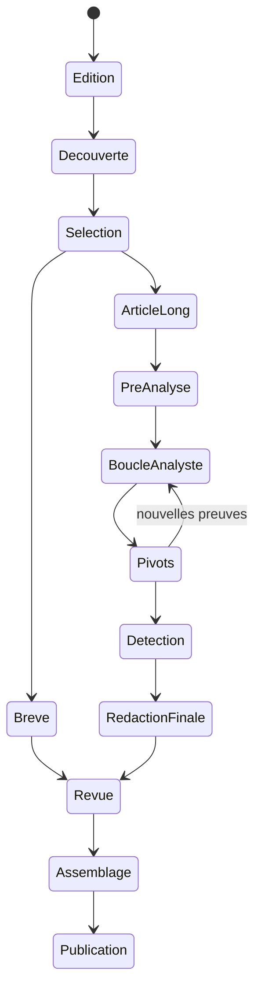

Oui. Je partirais sur une application web, plus précisément un **cockpit de production CTI avec des traitements asynchrones**.

Le navigateur ne communique jamais directement avec OpenAI, VirusTotal ou Shodan. Il permet de lancer des tâches, d’examiner leurs résultats et de franchir les validations humaines. Le backend conserve l’état réel du sujet, les preuves, fichiers et décisions.

La recherche OpenAI peut être exécutée en arrière-plan et suivie par l’application. La Responses API prend en charge la recherche web sourcée et les traitements asynchrones : [Web search](https://developers.openai.com/api/docs/guides/tools-web-search) et [Background mode](https://developers.openai.com/api/docs/guides/background).

## Workflow cible

### 1. Création de l’édition

L’utilisateur crée une édition :

* pays : Iran ;
* période : juillet 2026 ;
* TLP ;
* langues ;
* profils de sources ;
* cible indicative : deux articles longs et six brèves.

L’application charge :

* les sujets déjà traités pendant le mois ;
* les éditions précédentes ;
* les acteurs, campagnes, malwares et IOC connus ;
* les règles YARA et recherches déjà exécutées.

### 2. Découverte des sujets

L’utilisateur clique sur « Rechercher les sujets ».

Le backend lance une recherche OpenAI en arrière-plan avec plusieurs axes :

* activités APT liées à l’Iran ;
* acteurs étatiques ou supposés étatiques ;
* rapports techniques comportant IOC, échantillons ou configurations ;
* nouvelles campagnes, familles, variantes ou infrastructures ;
* victimologie, chaînes d’infection et évolutions de TTP ;
* publications dans la période demandée.

En parallèle, le système interroge les sources suivies, RSS, résultats Livehunt et imports manuels.

OpenAI est chargé de :

* trouver les publications ;
* identifier la source originale ;
* regrouper les reprises d’un même rapport ;
* distinguer les sources indépendantes des simples relais ;
* proposer un sujet commun ;
* évaluer la richesse technique du sujet.

Le résultat affiché est une liste de cartes :

| Champ                    | Exemple                        |
| ------------------------ | ------------------------------ |
| Sujet                    | Nouvelle campagne MuddyWater   |
| Source principale        | Rapport technique de l’éditeur |
| Sources associées        | 4                              |
| Échantillons disponibles | Oui                            |
| IOC disponibles          | 38                             |
| Potentiel de chasse      | Élevé                          |
| Nouveauté                | Nouvelle chaîne d’infection    |
| Déjà traité              | Non                            |
| Proposition              | Article principal              |

Le filtrage des doublons ne repose pas seulement sur le titre. Il utilise les URLs, dates, acteurs, familles, hash, IOC et similarité du contenu. Un sujet déjà traité peut apparaître comme « mise à jour » plutôt que disparaître.

### 3. Sélection éditoriale

L’utilisateur peut :

* sélectionner ou rejeter un sujet ;
* fusionner deux groupes ;
* séparer un groupe mal construit ;
* choisir `article principal` ou `brève` ;
* ajouter une publication manquante ;
* modifier le TLP ou la priorité.

À la validation, l’application crée automatiquement l’arborescence du sujet.

C’est le premier gate humain important : **le modèle propose, l’utilisateur compose l’édition**.

## Parcours d’une brève

### 4A. Constitution du dossier de preuves

Le système :

1. télécharge et archive les publications originales ;
2. extrait le texte et les pièces jointes ;
3. identifie la source primaire et les reprises ;
4. extrait les faits, dates, acteurs, malwares, CVE, TTP, victimologie et IOC ;
5. vérifie que chaque IOC est réellement présent dans une source ;
6. normalise et déduplique les indicateurs ;
7. construit un `brief_evidence_pack`.

Qwen traite le volume, les traductions et l’extraction initiale. OpenAI intervient pour les ambiguïtés, le regroupement et la rédaction.

### 5A. Rédaction et validation

La brève est générée à partir du dossier de preuves :

* fait central ;
* contexte ;
* portée opérationnelle ;
* éventuelles limites ;
* sources ;
* IOC associés.

L’application affiche chaque affirmation avec sa preuve. L’utilisateur peut corriger, valider ou promouvoir le sujet en article principal.

Après validation, le parcours s’arrête. Aucune chasse étendue ni règle YARA n’est lancée par défaut.

## Parcours d’un article principal

### 4B. Acquisition et extraction technique

Le système effectue le même travail que pour une brève, puis va plus loin :

* téléchargement des échantillons originaux disponibles ;
* triage statique ;
* récupération des informations VT ;
* extraction de configurations connues ;
* reconstruction provisoire de la chaîne d’infection ;
* inventaire des outils, commandes et techniques ;
* préparation de la victimologie ;
* chronologie des campagnes et variantes ;
* première cartographie ATT&CK.

Il produit une **synthèse technique de travail**, pas encore le texte définitif.

Cette distinction est importante : le premier texte sert à repérer les lacunes de l’analyse. La version publiable ne sera écrite qu’après les pivots et la rétroconception.

### 5B. Plan d’analyse et demandes à l’analyste

À partir des lacunes du dossier, OpenAI ou Qwen propose une liste de tâches.

Exemples :

* fournir la fonction de déchiffrement identifiée à telle adresse ;
* extraire les ressources du PE ;
* rechercher une configuration dans un blob donné ;
* confirmer l’algorithme de génération de domaine ;
* fournir le résultat de FLOSS, capa ou d’un décompilateur ;
* comparer deux fonctions ;
* vérifier la persistance ;
* analyser un paquet réseau ;
* confirmer que telle chaîne est spécifique à la famille.

Chaque demande doit comporter :

| Champ               | Rôle                                      |
| ------------------- | ----------------------------------------- |
| Question            | Ce que l’on cherche à établir             |
| Justification       | Pourquoi l’information manque             |
| Entrée attendue     | Fichier, fonction, capture, JSON, PCAP…   |
| Outil proposé       | Ghidra, IDA, FLOSS, capa, script…         |
| Commande indicative | Action reproductible                      |
| Risque              | Faible, isolé, manuel                     |
| Résultat attendu    | Format que l’application pourra réingérer |

Les tâches sûres et déterministes peuvent être automatisées dans une sandbox. La rétroconception interprétative reste humaine.

### 6. Boucle analyste–modèle

L’analyste sélectionne une tâche, réalise l’analyse et dépose le résultat :

* fonction décompilée ;
* notes ;
* configuration ;
* capture ;
* script d’extraction ;
* fichier déballé ;
* PCAP ;
* conclusion structurée.

Le système :

1. archive le résultat ;
2. le rattache à l’échantillon et à la question ;
3. met à jour le dossier de preuves ;
4. révise la synthèse technique ;
5. propose la question suivante ou indique que le niveau de preuve est suffisant.

L’analyste peut à tout moment :

* corriger l’interprétation ;
* ajouter une hypothèse ;
* interdire une conclusion ;
* déclarer une question hors périmètre ;
* arrêter la boucle ;
* définir le niveau de confiance.

L’« avis de l’analyste » peut être préparé par le modèle, mais ses champs sensibles restent contrôlés :

* constat technique ;
* interprétation ;
* hypothèses alternatives ;
* niveau de confiance ;
* limites ;
* attribution.

## 7. Pivots et chasse

Je modifierais légèrement l’ordre de votre exemple : les pivots interviennent **avant la version définitive de l’avis de l’analyste**, car leurs résultats peuvent modifier l’analyse.

L’application génère un plan de pivots depuis les invariants validés :

* hash et similarités ;
* chaînes rares ;
* configurations ;
* certificats ;
* imports ;
* PDB ;
* ressources et icônes ;
* relations VT ;
* domaines, IP et URLs ;
* TLS, favicon, JARM/JA4+ ;
* Shodan et passive DNS.

L’écran présente chaque pivot avec :

* graine ;
* requête exacte ;
* justification ;
* spécificité attendue ;
* risque de faux rapprochement ;
* portée découverte/attribution ;
* profondeur proposée.

L’utilisateur coche les pivots autorisés avant exécution.

### 8. Validation des résultats de chasse

Les résultats apparaissent sous forme de tableau et de graphe. Ils sont regroupés automatiquement, mais restent initialement `non validés`.

L’analyste classe chaque hit :

* lié au corpus ;
* variante ;
* contexte uniquement ;
* infrastructure partagée ;
* faux positif ;
* à examiner.

Seuls les résultats validés sont téléchargés dans le dossier du sujet. Ils sont ensuite réinjectés dans la boucle d’analyse.

Les vagues de chasse continuent jusqu’à ce que :

* aucun nouveau hit pertinent n’apparaisse ;
* les nouveaux liens soient trop faibles ou partagés ;
* le corpus soit suffisamment représentatif ;
* l’analyste décide d’arrêter.

## 9. Production des détections

Une fois le corpus validé :

1. constitution des corpus positif, négatif et holdout ;
2. extraction des invariants ;
3. génération d’une YARA ;
4. compilation et tests locaux ;
5. Retrohunt ;
6. analyse des faux positifs ;
7. itération ;
8. approbation humaine.

Suricata n’est proposée que si l’analyse fournit un invariant protocolaire stable et un moyen de le tester.

Les nouveaux IOC sont vérifiés, normalisés et associés à leur provenance avant d’être ajoutés au bulletin.

## 10. Rédaction finale

Le système gèle une version de l’`evidence_pack`, puis produit :

* synthèse ;
* contexte et chronologie ;
* analyse technique ;
* chaîne d’infection ;
* outils et TTP ;
* victimologie ;
* travail de pivot ;
* résultats de chasse ;
* avis de l’analyste ;
* YARA/Suricata ;
* IOC ;
* sources et figures.

Si une preuve change, le texte concerné repasse en état « à régénérer ».

L’utilisateur valide section par section, puis l’article rejoint le compositeur de l’édition.

## Écrans principaux

Je viserais cinq écrans seulement pour le MVP :

1. **Éditions** — pays, période et avancement.
2. **Découverte** — candidats, doublons, sélection long/brève.
3. **Workbench sujet** — sources, extraction, IOC, échantillons et synthèse.
4. **Analyse et chasse** — demandes analyste, pivots, graphe et hits.
5. **Rédaction et publication** — sections, références, détections et assemblage.

Le workbench pourrait utiliser ces onglets :

`Vue générale | Sources | Preuves | Échantillons | Analyse | Demandes analyste | Pivots | Chasse | Détections | Rédaction | QA`

## Juste milieu humain–automatisation

| Étape                     | Automatique              | Humain obligatoire                    |
| ------------------------- | ------------------------ | ------------------------------------- |
| Recherche et regroupement | Oui                      | Sélection des sujets                  |
| Extraction technique      | Oui                      | Correction des ambiguïtés importantes |
| Rédaction d’une brève     | Oui                      | Validation finale                     |
| Plan de rétroconception   | Proposition              | Réalisation/interprétation            |
| Pivots                    | Proposition et exécution | Autorisation du plan                  |
| Regroupement des hits     | Oui                      | Validation du corpus                  |
| Avis de l’analyste        | Brouillon assisté        | Conclusions et confiance              |
| YARA/Suricata             | Génération et tests      | Approbation                           |
| Publication               | Assemblage               | Validation finale                     |

La règle générale serait : **la machine prépare, exécute les tâches bornées et montre les preuves ; l’humain tranche tout ce qui change le sens analytique du livrable.**

Techniquement, je construirais donc le backend et la machine d’état en premier, puis une interface web assez fine par-dessus. Il ne faut surtout pas faire d’une conversation OpenAI la mémoire du sujet : l’état canonique doit rester dans la base, les manifestes et les `evidence_packs`.

